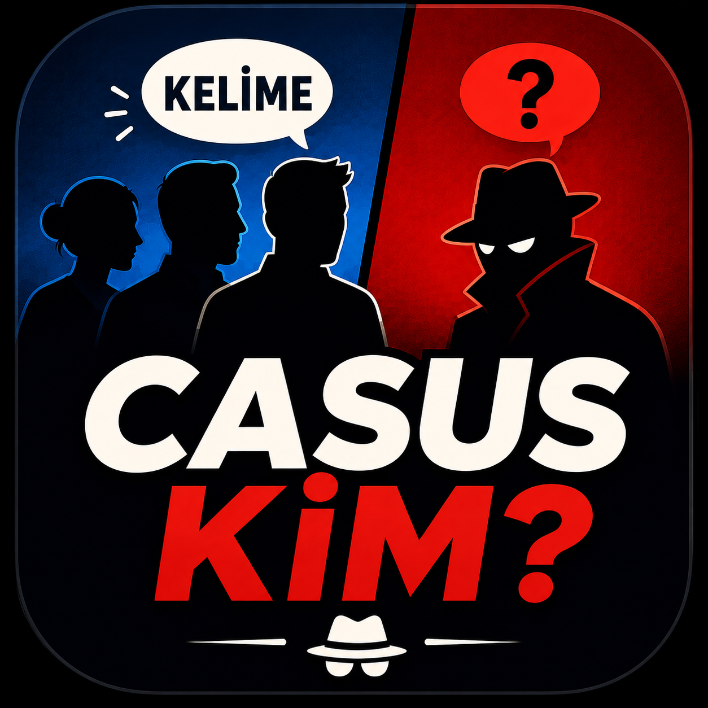
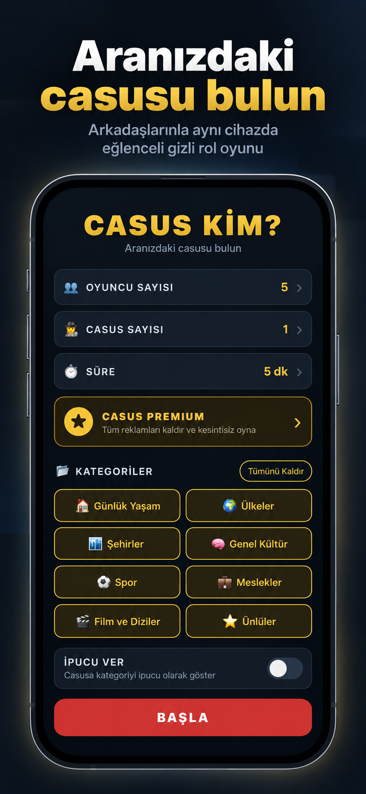
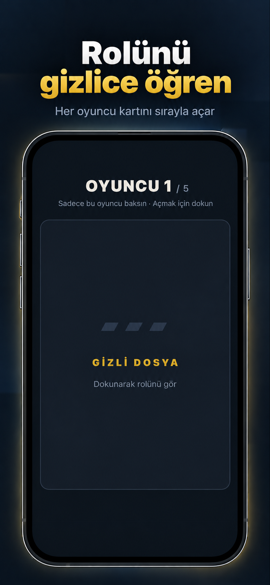
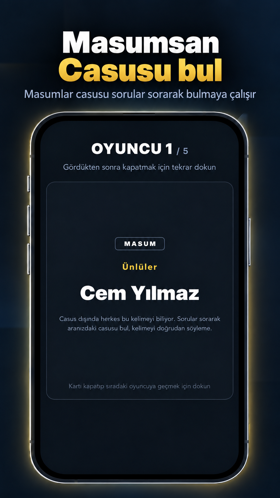
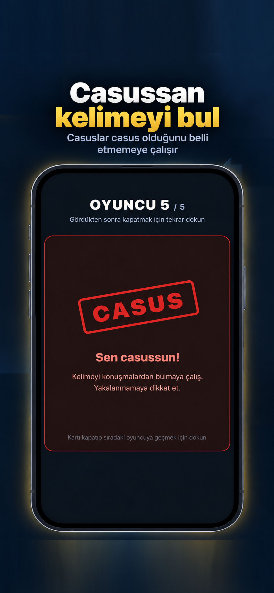
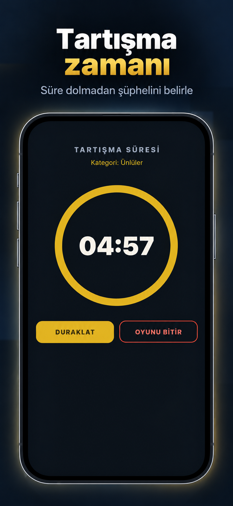
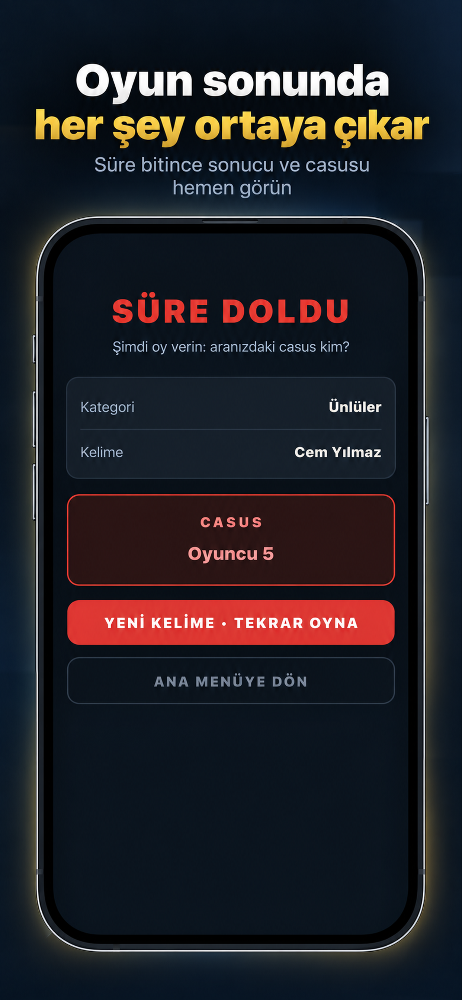
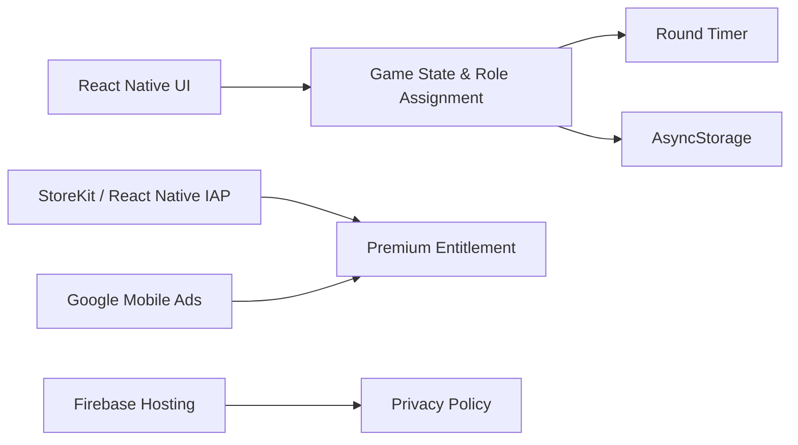

  

  # Casus Kim? — App Showcase

  **A Turkish social deduction party game for iPhone, designed for groups sharing a single device.**

  [View on the App Store](https://apps.apple.com/tr/app/casus-kim-gizli-kelime/id6799704506)

> This public repository is a product and engineering showcase. The production source code remains private and proprietary.

## Overview

Casus Kim? turns a phone into a party game for friends. Most players receive the same secret word while one or more spies must blend into the conversation without knowing it. Players ask questions, watch for suspicious answers, and vote when the discussion ends.

The game is built for quick, in-person sessions and runs on a single shared device.

## App Store Screenshots

  
  
  

  
  
  

## Product Highlights

- Configurable player count, spy count, and discussion duration
- Multiple Turkish word categories for varied sessions
- Optional category hints for the spy
- Private role reveal designed for passing one device between players
- Built-in discussion timer and end-of-round reveal
- Local settings and game progress persistence
- Premium subscription with purchase restoration
- Consent-aware, non-personalized mobile advertising
- Turkish-first interface and App Store distribution

## How It Works

1. Choose the number of players, spies, categories, and round duration.
2. Pass the phone around so every player can privately reveal their role.
3. Civilians receive the same secret word; spies only receive limited information.
4. Discuss, ask questions, and identify suspicious answers before time runs out.
5. Reveal the secret word and the spies, then start another round.

## Engineering Overview

The application uses an offline-first, single-device architecture. Core game state and role assignment stay on the device, while native integrations handle subscriptions, advertising consent, and App Store purchases.

### Selected Engineering Challenges

- Designing private role reveals for several players sharing one screen
- Keeping randomized role distribution fair across configurable player counts
- Preserving settings and completed-game state locally
- Integrating renewable subscriptions and purchase restoration
- Coordinating premium entitlement with ad visibility
- Implementing advertising consent and privacy controls
- Preparing native iOS builds and App Store release metadata with Expo EAS

## Technology Stack

- React Native
- Expo
- JavaScript
- Async Storage
- React Native IAP / StoreKit
- Google Mobile Ads
- Expo EAS Build
- Firebase Hosting for the privacy policy

## Availability

Casus Kim? is available on the Turkish App Store:

**[Download Casus Kim? on the App Store](https://apps.apple.com/tr/app/casus-kim-gizli-kelime/id6799704506)**

## Developer

Built by [Harun İlker Kaya](https://github.com/HarunIlkerKaya), a Software Engineering student focused on mobile and frontend product development.

## Source Code and Rights

The production source code is maintained in a private repository. This showcase contains promotional images and high-level technical documentation only. It does not grant permission to reproduce the application, branding, or visual assets.

See [NOTICE.md](NOTICE.md) for details.

